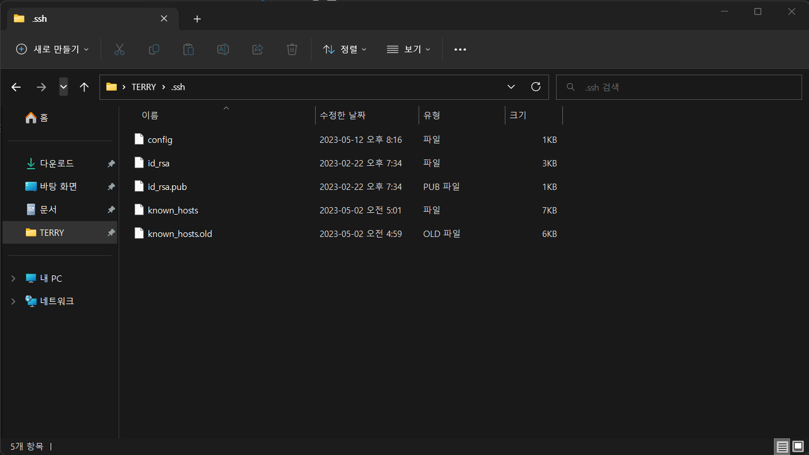
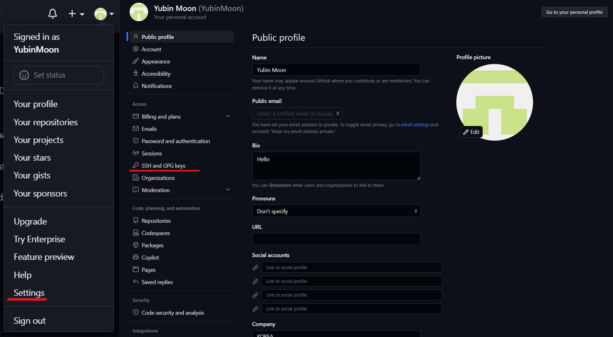
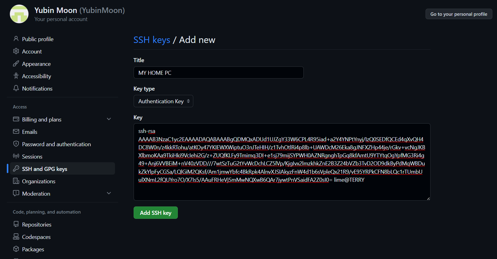
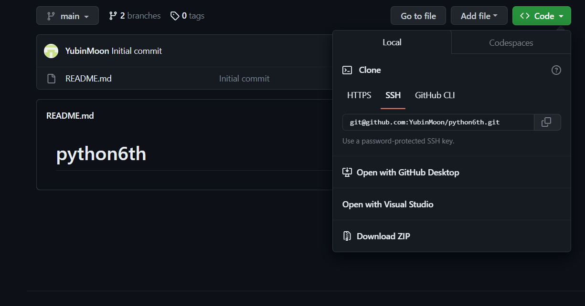

# GitHub에 ssh로 인증을 해보자

수업에서 Token으로 github 유저 인증을 알려주셨는데 Token으로 인증을 하면 기한도 제한이 있고 다른 디렉토리에서 인증을 다시 해줘야 했던 것 같아 조금 더 편한 ssh 인증 방법을 알려드리려 합니다.

## 방법

### SSH 키 생성

우선 윈도우 `CMD`를 열어줍니다.(~~powershell도 될걸요?~~)

``` batch
ssh-keygen -t rsa
```

이후로 나오는 건 모두 그냥 `엔터` 해주시면 됩니다.

그럼 윈도우나 맥 홈 디렉토리에 `.ssh`라는 새로운 폴더가 생길거에요. (폴더가 안보이시면 `숨김폴더 보기` 잘 찾아보세요.)

`.ssh.`폴더 내부에 다음과 같이 `id_rsa.pub`파일이 생기면 잘 되신거에요!

(`id_rsa.pub`파일은 공개키로 원래 공유를 위한 키니까 다른 사람에게 털려도 큰 상관은 없을텐데 `id_rsa`파일은 유저를 인증하기 위한 개인키니까 유출되지 않게 조심하세요! ~~자세히는 몰라요~~)



### GitHub SSH Key 등록

[GitHub](https://github.com/)들어가셔서 로그인 하시고 설정에 들어가 주세요.  
설정에서 SSH and GPG keys에 들어가 주세요



들어가면 SSH key나 GPG key를 등록할 수 있는데 그중에서 SSH의 `New SSH key`를 눌러주세요

아래와 같은 화면이 나오면 `Title`에 `현제 PC`의 명칭을 적어주고 `key`에는 아까 생성한 `id_rsa.pub`파일을 `메모장`이나 `VScode`로 켜서 내용을 복사해 주세요.



이제 `key`를 등록하시면 등록한 컴퓨터에선 Git에 자동으로 `SSH 인증`을 할 수 있어요  
다만 `SSH 인증`을 위해선 `git clone`이나 `git remote add`를 할 때 `https`대신에 `SSH`주소를 사용해야 할거에요



모두 좋은 공부 하시고 공개키 공유키 원리랑 계산법 아시는 분은 나중에 알려주시면 감사할 것 같아요